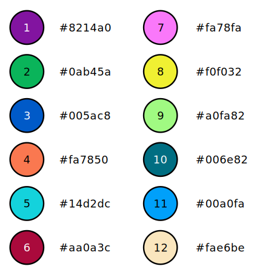

# gnuplot-config

Configuration snippets for gnuplot.

## Colour-blind friendly palette



Based on this excellent article:
[http://mkweb.bcgsc.ca/colorblind/](http://mkweb.bcgsc.ca/colorblind/)

## Installation

```bash
$ ./install.sh
```
